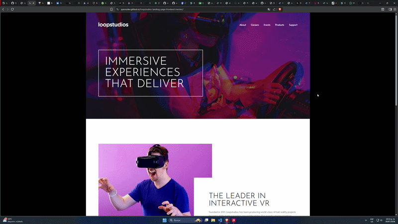

# Frontend Mentor - Loopstudios landing page solution

This is a solution to the [Loopstudios landing page challenge on Frontend Mentor](https://www.frontendmentor.io/challenges/loopstudios-landing-page-N88J5Onjw).

<a href="https://quirozdev.github.io/loopstudios-landing-page-frontend-mentor/" target="_blank">Live Site Demo</a>

## Table of contents

- [Overview](#overview)
  - [The challenge](#the-challenge)
  - [Links](#links)
- [My process](#my-process)
  - [Built with](#built-with)
- [Author](#author)

## Overview

### The challenge

Users should be able to:

- View the optimal layout for the site depending on their device's screen size
- See hover states for all interactive elements on the page

### Links

- <a href="https://github.com/Quirozdev/loopstudios-landing-page-frontend-mentor" target="_blank">Solution URL</a>
- <a href="https://quirozdev.github.io/loopstudios-landing-page-frontend-mentor/" target="_blank">Live Site URL</a>

## My process

### Built with

- React and Typescript
- TailwindCSS
- Responsive design
- CSS Grid
- Zustand

## Author

- GitHub - <a href="https://github.com/Quirozdev" target="_blank">Quirozdev</a>
